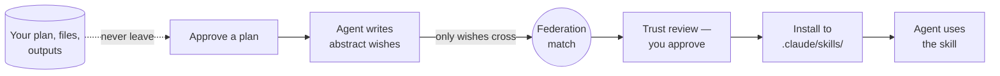

<div align="center">

# Skill Federation

### The trusted skill layer for AI agents

[](LICENSE)

-2E9E6B)


[](https://github.com/skill-federation/skill-federation/stargazers)

<a href="https://skill-federation.github.io/"></a>

**Your agent asks. Skill Federation answers. You approve.**

*A bare agent solves 17.5% of SkillsBench tasks. With Skill Federation, 22.8% — and your work never leaves your machine.*

</div>

---

Your coding agent keeps rebuilding things that a packaged **skill** already does well — PDF
extraction, market sizing, data cleaning, PR review, Slack notifications, SQL reporting. The
skills exist, scattered across the open-source ecosystem. The problem is *finding the right one
mid-task* — and every "search a catalog" approach so far means shipping your plan, your brief,
or your data to someone's server.

**Skill Federation finds skills the privacy-preserving way.** Right after you approve a plan,
your agent writes an abstract **wish-list** — "if every skill existed, which would I reach for?"
— and the federation matches those wishes against a catalog of vetted skills. Your plan, your
files, and your outputs never leave your machine. Only the abstract wishes do.

> [!IMPORTANT]
> **Only the abstract wish crosses the boundary** — a one-line capability description, a few
> vocabulary-varied paraphrases, 1–5 keywords, and a capability-level *sketch* of the ideal
> skill. Every field is "what skill should exist," never your task. Your plan, brief, file
> contents, and reasoning trace stay local — **always**.

<details>
<summary>Prefer plain text? Here's the same run</summary>

```
You: /skillfed automate monthly vendor-invoice reconciliation

  wish: pdf-data-extraction   -> pdf-processing        [MIT - verified]
  wish: data-cleaning         -> data-cleaning         [MIT - verified]
  wish: chat-notification     -> slack                 [MIT - verified, 235*]
  ...

  Install these 3? They'll go in .claude/skills/ with license + source attribution.
```

</details>

## 🔒 Why it's different

- **Privacy floor, by design.** Only the abstract wish crosses the boundary — a one-line
  capability description, a few vocabulary-varied paraphrases of it, 1–5 keywords, and a
  capability-level sketch of the ideal skill (all "what skill should exist", never your task).
  Your plan, brief, file contents, and reasoning trace stay local — always.
- **Trust before install.** Every candidate shows its license class, provenance, stars, source,
  and any security flags. *You* approve each install. Nothing is pulled silently.
- **Native, zero-install.** The default tier needs nothing but `curl` — already on Windows 10+
  and macOS. No Python, no Node, no package manager. (Optional tiers add typed MCP tools if you
  have Node.)

## ⚙️ How it works



1. **Plan.** You approve a plan in your agent as usual.
2. **Wish-list.** The agent sketches the ideal skills and writes up to 10 abstract wishes — each
   with vocabulary-varied paraphrases and a structured capability sketch for high recall. No task
   specifics.
3. **Match.** The federation runs a fast lexical search per wish (description + paraphrases +
   flattened sketch) and returns the top candidates.
4. **Review.** The agent picks the best fit (or rejects all) and shows you a trust table.
5. **Install.** On your approval, the chosen skills are fetched into `.claude/skills/` with
   full license + source attribution.
6. **Use.** Your agent uses the skill immediately — no reinventing it.

## 📊 Benchmark

<div align="center">



</div>

We measured Skill Federation on **SkillsBench** (coding-agent tasks with deterministic verifiers),
with the agent harnessed as **Claude Code (Opus 4.6)**. The catch that makes this a real test:
the skill Skillfed retrieves comes from a **26,629-skill snapshot of the public catalog** (which
holds 100k+ skills overall) **with the benchmark's own answer skills removed** — so this measures
whether *independently authored* skills transfer to the task, not whether we can re-find the
benchmark's hand-written one.

| Condition | What the agent gets | Success |
|---|---|---|
| No skill | bare Claude Code (Opus 4.6) | 17.5% |
| **Skillfed** | top skill retrieved from the 26,629-skill snapshot | **22.8%** |
| Oracle | the task's own hand-written skill — an unreachable upper bound | 36.8% |

Skillfed lifts success **from 17.5% to 22.8% — a ~30% relative gain** over the bare agent, and
recovers **~27% of the gap** to an oracle skill it never sees. Most skill-retrieval results test
*oracle-recovery* (the benchmark's own skill sits in the pool); this tests *transfer* — useful
skills pulled from a large, noisy public catalog.

## 📦 Install

From this repo's root:

```powershell
# Windows (PowerShell)
.\install.ps1
```
```bash
# macOS / Linux
chmod +x install.sh && ./install.sh
```

> [!TIP]
> Then **restart Claude Code** and run `/skillfed <what you're trying to do>` — or just approve
> a plan and the finder offers itself automatically.

**Or just ask Claude Code.** Don't want to touch a terminal? Paste this and let it do the setup:

```text
Set up the Skill Federation "/skillfed" finder from
github.com/skill-federation/skill-federation — clone the repo and run its
installer (install.ps1 on Windows, install.sh on macOS/Linux) from the repo
root, then tell me to restart Claude Code and try /skillfed.
```

It'll ask permission to clone and run the script. Prefer something deterministic? The shell
one-liner above is the canonical path.

The installer auto-detects your machine and always installs the **curl** tier (zero runtime).
Opt into more with flags:

<details>
<summary>Optional tiers (hook · npx MCP · python)</summary>

| Tier | Needs | Enable | Gets you |
|---|---|---|---|
| **curl** (default) | nothing (`curl` ships with Win10+/macOS) | *always* | the finder skill + `/skillfed`, runtime-free |
| **hook** | nothing | `--with-hook` / `-WithHook` | auto-nudge right after a plan is approved |
| **npx** (Node MCP) | Node >= 18 | `--with-npx` / `-WithNpx` | Claude calls typed `find_skills` tools, no shell-out |
| **python** | a Python interpreter | `--with-python` / `-WithPython` | the advanced / CI helper path |

</details>

See [`install.md`](install.md) for options, scopes, and safety details (it backs up and merges
config, never clobbers).

## 🛡️ Privacy & trust

> [!NOTE]
> **What never crosses:** your plan, brief, file contents, outputs, or reasoning trace.
> **What does:** only the abstract wish (description + paraphrases + keywords + capability sketch).

<details>
<summary>The full field-by-field breakdown</summary>

- **What crosses the boundary:** the abstract wish — its one-line `description`, ~4 paraphrased
  `formulations` of it, 1–5 `keywords`, and a structured **capability `sketch`** of the ideal skill
  (`purpose / inputs / outputs / operations / domain_vocab / section_sketch / tags`). The sketch's
  flattened terms ride inside the search query on every search (they supply the discriminative
  vocabulary that drives recall); when no skill is found, that same sketch becomes the demand
  pointer — abstract enough to protect you, detailed enough to auto-build the missing skill. Every
  field is "what skill should exist", never your task. The wish's `name` is display-only and is not
  sent.
- **What never crosses:** your plan, brief, file contents, outputs, or reasoning trace.
- **Two complementary signals, not conflated:** a `report_selection` labels retrieval quality
  (which shown candidates were right or wrong); a `report_demand` captures the capability gap (what
  was actually needed). They feed different loops — selection sharpens search, demand drives what
  gets built next.
- **Local-first:** if you already have a skill installed, your local copy is used as-is — your
  edits are personalization, never silently overwritten.

</details>

## 🔧 Configuration

The finder talks to a federation endpoint over HTTPS. Default is a keyless demo; override it:

```bash
export SKILLFED_ENDPOINT="https://your-federation.example.com"   # or set in .mcp.json for the npx tier
```

## 📁 What's in this repo

```
install.ps1 / install.sh / install.md   one-command, auto-detecting installer
integrations/claude-code/               the Claude Code plugin (skill + /skillfed + hook)
integrations/*.py                       optional Python tier (advanced / CI)
mcp-server/                             optional Node MCP tier (typed tools via npx)
```

## 📄 License

[MIT](LICENSE) © Skill Federation.
