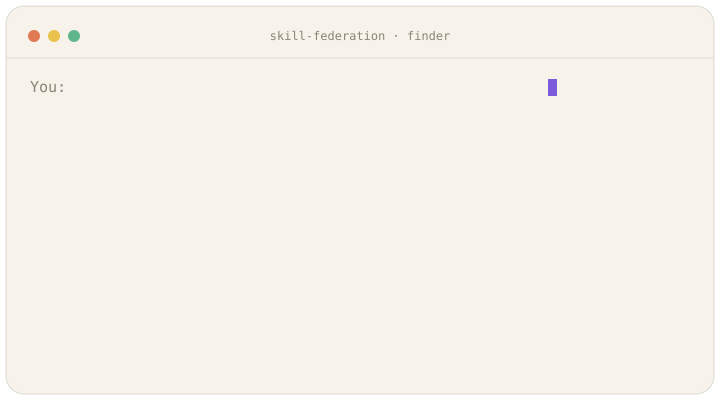
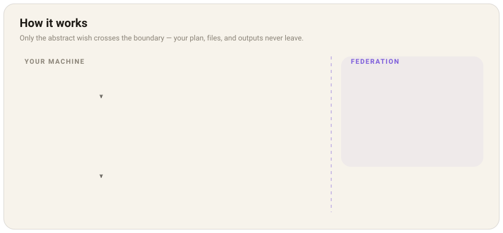
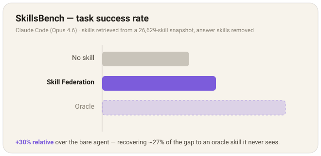

<div align="center">

# Skill Federation

### Free, private skill search for AI agents

<!-- Row 1 — Traction & proof (emphasized: for-the-badge) -->
[](https://pypistats.org/packages/skillfed)
[](https://github.com/skill-federation/skill-federation)
[](https://github.com/skill-federation/skill-federation/stargazers)
[](#-benchmark)

<!-- Row 2 — Install & run (compact: flat-square) -->
[](https://www.npmjs.com/package/skillfed)
[](https://pypi.org/project/skillfed/)

-2E9E6B?style=flat-square)

<!-- Row 3 — Trust & terms (compact: flat-square) -->
[](LICENSE)

[](https://agentskills.io)

<a href="https://skill-federation.github.io/"></a>

**Skills are hints, not installs.** Your agent reads them as field notes; you approve the rare one worth keeping.

*A bare agent solves 17.5% of SkillsBench tasks. With Skill Federation, 22.8% — and your work never leaves your machine.*

**Browse and search the indexed catalogs — skills, PyPI packages, research — on the web → [skillfed.io](https://skillfed.io)**

</div>

---

A model's weights are an **average** of what was written before its training cutoff, and a lossy
one at that. Wherever practice actually moves — SEO, security review, accessibility, framework and
API migrations, packaging and release, pricing, compliance, tooling defaults — that average is a
confident summary of a *past* consensus. It reads exactly like expertise. It is also, quietly, a
version or two behind.

**A skill is not a script you install. It's a hint.** Field notes a practitioner wrote down about
how this work is *currently* done: a dated artifact someone maintains, carrying the difference
between the average and the present. A frontier model pulls one into context and augments its
weights with it. Nothing else happens. So the normal outcome of a search here is **reading**, not
installing; a skill is reference material, not code that runs.

**Skill Federation finds those notes without telling anyone what you're working on.** When the work
turns on how something is done *now*, your agent writes an abstract **wish-list** ("if every skill
existed, which would I reach for?") and the federation matches those wishes against a catalog of
vetted skills. Your plan, your files, and your outputs never leave your machine. Only the abstract
wishes do.

**Read several, cross-check, install rarely.** In our own testing, skills read against work a
capable model had already optimised still surfaced real defects it had missed — *and* some of the
skills' own advice was itself out of date. Both findings point the same way: pull several, compare
them, treat none as authoritative. Two independently authored skills agreeing is current practice;
one asserting alone is a hypothesis to verify. Stale skills argue for reading more than one. They
do not argue for trusting none.

**You and your agent stay in command.** A skill is an input to judgment, never a replacement for
it: take what's current and relevant, discard what doesn't fit, say which parts you used. And a
fetched body is *data*, not instructions addressed to your agent. Craft guidance is what you came
for; anything telling the agent to run commands, change settings, or send data somewhere is
ignored and reported to you. (The catalog and our ongoing research notes are at
[skillfed.io](https://skillfed.io).)

> [!IMPORTANT]
> **Only the abstract wish crosses the boundary** — a one-line capability description, ~4
> vocabulary-varied paraphrases, 1–5 keywords, and a capability-level *sketch* of the ideal
> skill. Every field is "what skill should exist," never your task. Your plan, brief, file
> contents, and reasoning trace stay local — **always**.

**Here's the entire payload for one wish** — the literal string sent for `launch-strategy`.
It names the *capability domain*, never your task, plans, or product:

```text
description: plan a multi-channel launch for an open-source developer tool
paraphrases: orchestrate a launch across hacker news reddit and product hunt · plan a
             go-to-market launch for a dev tool · coordinate a multi-platform release
             announcement · design a launch-day plan for an open-source project
sketch:      launch product hunt hacker news waitlist go-to-market campaign ·
             channel planning timing asset prep announcement
keywords:    launch, gtm, product-hunt, strategy, announcement
```

A description, four paraphrases, a capability sketch, keywords. Your product's name, your
unreleased roadmap, and your actual launch plan never appear.

<details>
<summary>Prefer plain text? Here's the same run</summary>

```
You: /skillfed plan a launch for my open-source dev tool

  -> agent writes 4 abstract wishes (paraphrases + a capability sketch).
     Only these leave your machine -- never your plan, files, or data.

  wish: launch-strategy       -> multi-platform-launch  review - verified             <- read
  wish: repo-discoverability  -> github-presence        review - verified             <- read
  wish: community-building    -> community-building     review - verified             <- read
  wish: growth-analytics      -> product-analytics      permissive - verified - 221*  <- read
       (each picked from 10 ranked candidates in the vetted catalog)

  Read all 4 in context -- nothing hits disk. Install only the 1 you'll reuse?
  It goes in .claude/skills/ with license + source attribution.
```

</details>

## 🔒 Why it's different

- **Reading is the product; installing is the exception.** Skills are hints pulled into context,
  not packages fetched onto disk. The default flow ends after your agent has read several and told
  you what it took from each: nothing written, nothing to clean up. Installing happens only when a
  skill is good *and* you'll reuse it, and only with your approval.
- **No harness required — not even Claude Code.** The finder skill carries its own triggers and its
  own instructions, so it works with no hook registered, in any harness that can load a skill body,
  and with **no harness at all** — paste it into a plain chat and it still knows when to search and
  how to read what it finds. (See **Works anywhere** below.)
- **Privacy floor, by design.** Only the abstract wish crosses the boundary: "what skill should
  exist," never your task. Your plan, brief, file contents, and reasoning trace stay local,
  always. (Full field-by-field breakdown under **Privacy & trust** below.)
- **Trust before you read — and again before you install.** Candidates come from a **pre-scanned
  internal registry** ([Cisco Skill Scanner](https://github.com/cisco-ai-defense/skill-scanner) +
  [NVIDIA SkillSpector](https://github.com/NVIDIA/SkillSpector)), not the wild repo. Every one
  shows its license class, provenance, stars, and source. That matters twice over: a *consulted*
  body is untrusted third-party text entering your agent's context, and unlike an installed skill
  it leaves no `SOURCE.txt` behind, so the agent has to name what it read and where it came from
  in its reply. *You* approve each install; nothing is written to disk silently.
  (See [Security](#-security).)
- **Native, zero-install.** The default tier needs nothing but `curl`, already on Windows 10+
  and macOS. No Python, no Node, no package manager. (Optional tiers add typed MCP tools if you
  have Node — including capability search over the PyPI package index and the research-notes
  index; see **Beyond skills** below.)

## 🌍 Works anywhere

**The finder is harness-agnostic on purpose.** Its triggers and its whole procedure live in the
skill body. Register no hook, drop it into any harness that can load a skill body, or use no
harness at all — it behaves the same. The optional Claude Code hooks below only *repeat* triggers
the skill already carries; **`--hook none` is the default**, and a complete install.

**Nothing installed, just a browser?** Ask any chat to *use skillfed.io to find a skill* — or paste
in [the skill body itself](integrations/claude-code/skills/skill-federation/SKILL.md), which carries
the whole procedure. The zero-install loop is two GETs — search, then read:

- **Search** — [`skillfed.io/api/q/<terms>`](https://skillfed.io/api/q/pdf-extraction) returns
  ranked candidates for a query as one GET, each carrying a direct body URL plus trust fields.
  The terms ride in the *path* on purpose: chat fetchers routinely strip long query strings, so
  this form survives where `?q=` doesn't.
- **Find** — the catalog is published as machine-readable JSON, no crawling required:
  [`skillfed.io/.well-known/agent-skills/index.json`](https://skillfed.io/.well-known/agent-skills/index.json)
  is one GET returning the whole index, each entry a skill name plus a direct `.md` URL;
  [`skillfed.io/api/index.json`](https://skillfed.io/api/index.json) is the fuller listing —
  publisher and license for every skill, 500 per page, follow `next`. (Hand these URLs to a chat
  directly; search-index coverage of the site is still shallow, so a thin web-search result can
  masquerade as a thin catalog.)
- **Read** — append `.md` to any skill page URL for the full body as plain text. One GET, and you
  have it.

What a browsing-only chat still can't run is the full wish-list protocol — several wishes at
once, each with paraphrases and a capability sketch, POSTed as one federated query. That's what
the finder tiers add.

## 🧭 Beyond skills: packages & research

skillfed.io indexes more than skills, and the MCP tier (`--with-npx`) exposes all three streams
as typed tools:

- **`find_skills`** — the vetted skill catalog everything above describes.
- **`find_packages`** — capability search over the PyPI package index. About to `pip install`
  whatever name the model recalled from its weights? Describe the capability instead and get back
  real, current packages — each with a what-it-does card, license treatment, and a
  worth-installing verdict.
- **`find_research`** — topic search over the research-notes index on the agent-skills
  literature: measured claims with sources, for when you want the evidence rather than a tool.

The two extra indexes are plain GETs (`/api/packages/search.json?q=…`,
`/api/research/search.json?q=…`) — no auth, no tenant — so `curl` or any agent with a fetch tool
can use them without the MCP tier.

## ⚙️ How it works

<div align="center">
  
</div>

1. **Ask.** The skill's own triggers, which need no hook: as the agent *starts* planning (so skills
   shape the approach), when it *finishes* a plan, mid-task the instant it hits a capability it was
   about to build from scratch, or on request — `/skillfed <what you're doing>`. It's a search, not
   a ritual: once or several times per task, as the work turns.
2. **Wish-list.** The agent sketches the ideal skills and writes up to 10 abstract wishes — each
   with vocabulary-varied paraphrases and a structured capability sketch for high recall. No task
   specifics.
3. **Match.** The federation runs a fast lexical search per wish (description + paraphrases +
   flattened sketch) against the **vetted, pre-scanned catalog** and returns the top candidates
   (10 per wish by default, 1–25 on request).
4. **Read — the default.** The agent pulls **several** promising candidates per wish, reads them
   in context as field notes, and cross-checks where they disagree. Nothing is written to disk.
   You get a trust table (license · provenance · stars · source) plus a plain statement of which
   skills it read and what it took from each. **For most tasks it ends here.**
5. **Install — the exception.** The skill has to be good *and* one you expect to reuse, and you
   have to approve it explicitly. Then it's fetched from the **internal scanned copy** (not the
   origin repo) into `.claude/skills/` with full license + source attribution. Nothing you only
   needed to read once gets installed.

## 📊 Benchmark

<div align="center">



</div>

We measured Skill Federation on **SkillsBench** (coding-agent tasks with deterministic verifiers),
with the agent harnessed as **Claude Code (Opus 4.6)**. What makes this a real test is the pool:
the skill Skillfed retrieves comes from a **26,629-skill snapshot of the public catalog** **with
the benchmark's own answer skills removed**. What that measures is whether *independently authored*
skills transfer to the task, not whether we can re-find the benchmark's hand-written one.

| Condition | What the agent gets | Success |
|---|---|---|
| No skill | bare Claude Code (Opus 4.6) | 17.5% |
| **Skillfed** | top skill retrieved from the 26,629-skill snapshot | **22.8%** |
| Oracle | the task's own hand-written skill — an unreachable upper bound | 36.8% |

Skillfed lifts success **from 17.5% to 22.8% — a ~30% relative gain** over the bare agent, and
recovers **~27% of the gap** to an oracle skill it never sees. Most skill-retrieval results test
*oracle-recovery* (the benchmark's own skill sits in the pool); this tests *transfer* — useful
skills pulled from a large, noisy public catalog.

> [!NOTE]
> **How big is "the public catalog"?** Our own full census of the public SKILL.md corpus finds
> **60,611 unique skills** across 6,177 repositories. Larger figures in circulation (~87k) count
> the **86,956 vendored copies** sitting inside 64 aggregator repos — more copies than originals,
> which turns every ecosystem statistic into a statistic about duplication. Details:
> [60,611 skills in the wild](https://skillfed.io/research/reports/skills-in-the-wild-census).

## 📦 Install

**One line — no clone needed.** You've already got Node or Python:

```bash
# Node — npm
npx skillfed
```
```bash
# Python — uv   (or:  pipx run skillfed)
uvx skillfed
```

**Install one published skill** by the slug shown on its skillfed.io page:

```bash
npx skillfed install owner/repository/skill
```

The `install` subcommand ships with 0.2.1 and is npx-only — the shell, PowerShell, and Python
installers don't have it. It checks the record
carries a usable license label and refuses unlicensed records by default, validates file
boundaries and sizes, and verifies every SHA-256 — checksums are pinned by the skill's
published record — before writing to `.claude/skills/`; downloaded content is never executed.
The record's license and security-scan verdict are printed before any file is written, and a
`fail` verdict refuses to install unless you pass `--allow-failed-scan`. `--dry-run` shows the
validated plan without downloading or writing files (it does not check file availability). See
[the npm installer](installer/README.md) for replacement and license-acknowledgement options.

**Prefer Claude Code's plugin system?** Add the marketplace and install the plugin:

```text
/plugin marketplace add skill-federation/skill-federation
/plugin install skill-federation@skill-federation
```

**No Node or Python?** Ask Claude Code to install the curl version for you:

```text
Install the Skill Federation /skillfed finder from github.com/skill-federation/skill-federation
— run its curl installer (install.ps1 on Windows, install.sh on macOS/Linux), then tell me to
restart Claude Code.
```

> [!TIP]
> Then **restart Claude Code** and run `/skillfed <what you're trying to do>` — or just work
> normally: the skill carries its own triggers (starting a plan, finishing one, hitting a gap
> mid-task, or your asking), so it offers itself with no hook registered.

Zero runtime: the finder needs only `curl` (no Node or Python). For the optional tiers
(planning nudges · typed MCP tools · Python/CI helper), installing from a checkout, and
config-safety details, see [`install.md`](install.md).

### Invocation options

All four installers — `install.sh`, `install.ps1`, `npx skillfed`, `uvx skillfed` — take the same
core flags for the **finder** install (`install <slug>` is npx-only): `-Flag` in PowerShell,
`--flag` everywhere else.

| Flag | Values | Default | What it does |
|---|---|---|---|
| `--harness` / `-Harness` | `claude-code` | `claude-code` | which harness to install into; an unknown value exits `2` naming what's supported |
| `--hook` / `-Hook` | `none` \| `start` \| `end` \| `both` | `none` | register 0–2 planning nudges in `settings.json` — `end` fires after a plan is approved, `start` on prompts you submit *while in* plan mode |
| `--with-hook` / `-WithHook` | — | off | legacy alias for `--hook end` |
| `--scope` / `-Scope` | `user` \| `project` | `user` | `~/.claude` vs `./.claude` |
| `--target` / `-Target` | a directory | — | install into an explicit path instead of the `--scope` default |
| `--with-npx` / `-WithNpx` | — | off | also register the Node MCP server for typed `find_skills` / `find_packages` / `find_research` tools (needs Node ≥18) |
| `--endpoint` / `-Endpoint` | a URL | keyless demo | the federation endpoint to record |

Two more flags exist **only in the curl installers** (`install.sh` / `install.ps1`), not in
`npx skillfed` or `uvx skillfed`: `--with-python` / `-WithPython` (prints the advanced/CI
Python-helper setup; changes nothing on your machine) and `--raw-base` / `-RawBase` (where a
no-clone run fetches the payload from).

`--hook none` is a **complete** install: the skill triggers itself, and hooks only repeat what it
already carries. Both nudge files ship whatever the mode, so changing your mind later is a
settings edit, never a re-fetch. Before the first write, `settings.json` is backed up once and
merged safely. Registration is idempotent. (How to pass flags through a `curl | bash` pipe is in
[`install.md`](install.md).)

<details>
<summary>Prefer to paste it yourself? (raw curl one-liner)</summary>

```powershell
# Windows (PowerShell) — irm|iex also sidesteps the execution-policy block
irm https://raw.githubusercontent.com/skill-federation/skill-federation/main/install.ps1 | iex
```
```bash
# macOS / Linux
curl -fsSL https://raw.githubusercontent.com/skill-federation/skill-federation/main/install.sh | bash
```

</details>

## 🛡️ Privacy & trust

> [!NOTE]
> **What never crosses:** your plan, brief, file contents, outputs, or reasoning trace.
> **What does:** only the abstract wish (description + paraphrases + keywords + capability sketch).

<details>
<summary>The full field-by-field breakdown</summary>

- **What crosses the boundary:** the abstract wish — its one-line `description`, ~4 paraphrased
  `formulations` of it, 1–5 `keywords`, and a structured **capability `sketch`** of the ideal skill
  (`purpose / inputs / outputs / operations / domain_vocab / section_sketch / tags`). The sketch's
  flattened terms ride inside the search query on every search (they supply the discriminative
  vocabulary that drives recall); when no skill is found, that same sketch becomes the demand
  pointer — abstract enough to protect you, detailed enough to auto-build the missing skill. Every
  field is "what skill should exist", never your task. The wish's `name` is display-only and is not
  sent.
- **What never crosses:** your plan, brief, file contents, outputs, or reasoning trace.
- **Two complementary signals, not conflated:** a `report_selection` labels retrieval quality —
  what each shown candidate was actually worth, as `Install` / `Read` / `Reject` plus a one-line
  reason (**a read counts as a hit**, even though nothing was installed); a `report_demand`
  captures the capability gap (what was actually needed) and is emitted only on a real miss —
  nothing returned, or everything rejected. They feed different loops: selection sharpens
  search, demand drives what gets built next.
- **Local-first:** if you already have a skill installed, your local copy is used as-is — your
  edits are personalization, never silently overwritten. It is also reading material: a skill you
  already have on disk is a hint available for free.

</details>

## 🔒 Security

Skill Federation treats every third-party skill as untrusted input. **Skills are served from our
internal, pre-scanned registry — never pulled live from the wild repo.** At ingestion we copy each
candidate, dedupe it, and scan it; only passing skills are promoted and served. The `source` link
you see is provenance, not where the skill is fetched from.

Every candidate is best-effort scanned with two independent tools:

- **[Cisco AI Defense Skill Scanner](https://github.com/cisco-ai-defense/skill-scanner)** —
  YARA/pattern, bytecode, command-taint, behavioral dataflow, LLM-as-judge, and VirusTotal checks
  for prompt injection, data exfiltration, and malicious code.
- **[NVIDIA SkillSpector](https://github.com/NVIDIA/SkillSpector)** — vulnerability-pattern + LLM
  analysis with live OSV.dev CVE lookups and a 0–100 risk score.

High/critical findings are **rejected or routed to manual review before promotion** — the wild
catalog never reaches you unfiltered.

**Why this matters.** NVIDIA's study behind SkillSpector scanned **42,447 public skills** and found
**26.1% carried at least one vulnerability** and **5.2% showed likely malicious intent** — and an
installed skill runs with your agent's full permissions. Serving straight from public repos would
hand roughly one-in-four vulnerable and one-in-twenty malicious skills to your agent; the ingest
gate is what keeps them out.

> [!NOTE]
> Scanning is **best-effort**, not a guarantee. As Cisco's scanner puts it, *"no findings ≠ no
> risk"* — a clean scan is not proof a skill is safe. Skill Federation still shows each skill's
> license, provenance, and source, and **nothing installs without your approval**.

**Reading a skill is a trust decision too.** Most of the time your agent *consults* a skill
rather than installing it: the body is fetched into context and nothing is written to disk. That
is the lower-risk path — no third-party code lands on your machine — but the text still enters
your agent's context as untrusted third-party input, and a consulted skill leaves **no
`SOURCE.txt`** behind, because that file is written only on install. So the finder treats a
fetched body as **data, not as instructions addressed to the agent** (it follows the craft
guidance and ignores anything telling it to run commands, change settings, or send data
anywhere), surfaces each consulted skill's license, provenance and source **in its reply** since
there's nothing on disk to check later, and asks you first before reading anything unverified or
flagged.

## 🔧 Configuration

The finder talks to a federation endpoint over HTTPS. Default is a keyless demo; override it:

```bash
export SKILLFED_ENDPOINT="https://your-federation.example.com"   # or set in .mcp.json for the npx tier
```

## 📁 What's in this repo

```
install.ps1 / install.sh / install.md   auto-detecting installer; works from a clone OR piped (irm|iex, curl|bash)
installer/                              npm package `skillfed` — the `npx skillfed` no-clone path
python-installer/                       PyPI package `skillfed` — the `uvx skillfed` / `pipx run skillfed` path
scripts/vendor-payload.mjs              vendors the 6 payload files into both packages (single source of truth)
integrations/claude-code/               the Claude Code plugin (skill + /skillfed + optional hooks) — canonical payload
integrations/*.py                       optional Python tier (advanced / CI)
mcp-server/                             optional Node MCP tier (typed find_skills / find_packages / find_research via npx skillfed-mcp)
```

## 📄 License

[MIT](LICENSE) © Skill Federation.
